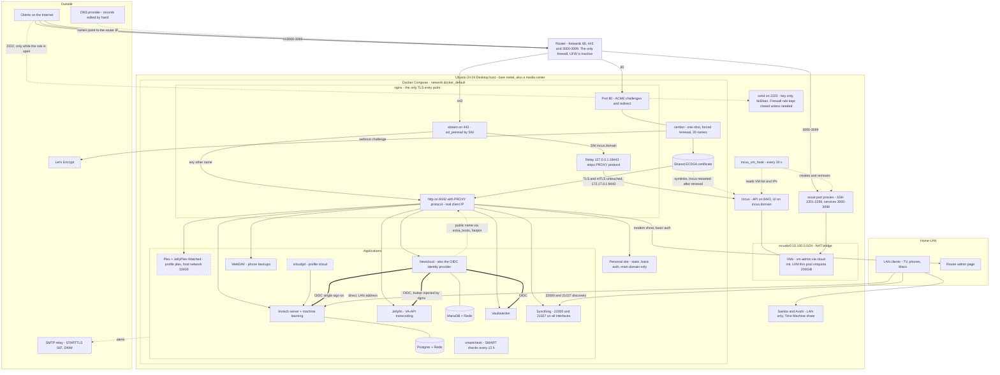
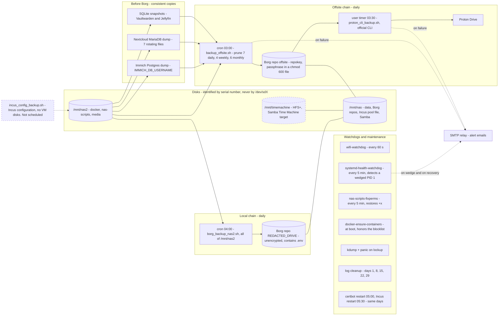
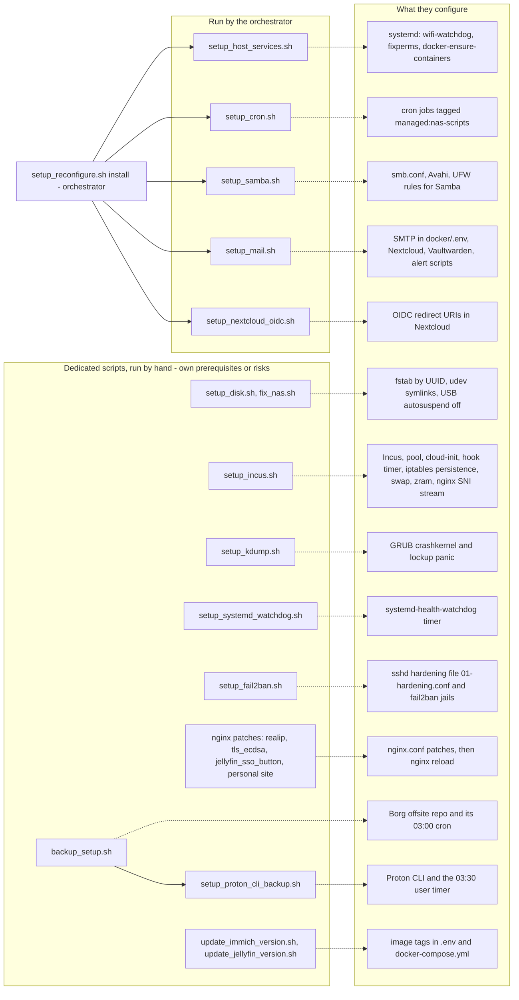

# tidepool — a self-hosted home server, as code

> **This is the README of the v0 archive** (tag `v0`), kept as it was written. It describes the Ubuntu server that tidepool replaces,
> and it is accurate for that point in time ("Phase 1 ... not started yet" included). The re-engineered system is described in the [root README](../README.md);
> `docker/` and `nas-scripts/` are still here because they are the specification of what must be migrated.

Scripts, configuration and lessons from **tidepool**, a home server that runs photos, media,
personal cloud, password manager, virtual machines and backups for a family. Everything lives on one Ubuntu machine,
in plain shell scripts and one Docker Compose file.

The name is the metaphor: a tide pool is a small, closed ecosystem where many different organisms live side by side and depend on each other, and it follows the rhythm of the tides,
much like the cron jobs, backups and renewals that keep this one alive. In the scripts and in the Borg archive names, `tidepool` is also the name of the server itself.

## Contents

- [Why this repo exists](#why-this-repo-exists)
- [Anonymization and what is not here](#anonymization-and-what-is-not-here)
- [How the repo is organized](#how-the-repo-is-organized)
- [System overview](#system-overview)
  - [Architecture at a glance](#architecture-at-a-glance)
    - [1. Runtime: how a request travels](#1-runtime-how-a-request-travels)
    - [2. Storage, backups and automation: what keeps it alive](#2-storage-backups-and-automation-what-keeps-it-alive)
    - [3. Which script configures what](#3-which-script-configures-what)
  - [Design principles](#design-principles)
  - [Storage](#storage)
  - [Services overview](#services-overview)
  - [Virtualization](#virtualization)
  - [Network](#network)
  - [Backups](#backups)
  - [Custom systemd automations](#custom-systemd-automations)
  - [What runs when](#what-runs-when)
- [The scripts](#the-scripts)
  - [Catalogue](#catalogue)
  - [Backups in detail](#backups-in-detail)
  - [Mail](#mail)
  - [Optional services (Compose profiles)](#optional-services-compose-profiles)
  - [SSO with Nextcloud as identity provider](#sso-with-nextcloud-as-identity-provider)
  - [Incus VM manager](#incus-vm-manager)
  - [Cron jobs](#cron-jobs)
  - [Watchdogs and crash diagnostics](#watchdogs-and-crash-diagnostics)
  - [Executable bit](#executable-bit)
  - [systemd units and who installs them](#systemd-units-and-who-installs-them)
- [The Docker stack](#the-docker-stack)
  - [Compose services and container names](#compose-services-and-container-names)
  - [Ports and exposure](#ports-and-exposure)
  - [SSH exposure](#ssh-exposure)
  - [The shared certificate](#the-shared-certificate)
  - [Configuration and secrets](#configuration-and-secrets)
  - [Jellyfin notes](#jellyfin-notes)
- [Rebuilding from an empty server](#rebuilding-from-an-empty-server)
- [Lessons learned](#lessons-learned)
  - [Incidents](#incidents)
  - [Gotchas worth remembering](#gotchas-worth-remembering)
- [Limits of the reconstruction](#limits-of-the-reconstruction)
- [Interesting areas to study for your implementation](#interesting-areas-to-study-for-your-implementation)
  - [Trade-offs and rough edges](#trade-offs-and-rough-edges)
  - [Decisions already taken for the re-engineering](#decisions-already-taken-for-the-re-engineering)
    - [Application stack](#application-stack)
    - [Proposed layers](#proposed-layers)
    - [Three final combinations (same L0, different depth)](#three-final-combinations-same-l0-different-depth)

## Why this repo exists

None of this was written to be published. It started as a private hobby: a place to test things, practice, and see how
far a single machine at home can go. The scripts were written for one person on one server, with local paths, real hostnames
and a lot of "I'll clean this up later".

Only afterwards did publishing it start to look interesting. Self-hosting has a reputation for being hard, and it is
less hard than it looks once you get used to it. It is also very satisfying and endlessly customizable: you decide where your photos live,
which provider sees your data, and what happens at 3 a.m. when something breaks. If this repo makes one more person try running
their own services, or gives them a script or an idea to steal, it did its job.

That origin explains two things you will notice:

- **The anonymization.** Because the code was never meant to leave the machine, it was full of identifying values. They have all been replaced
  with placeholders (see below), so the structure and logic are intact but nothing points back to a real person, host or network.
- **The history.** The early history was not written by hand: it was reconstructed from backups (see [How the repo is organized](#how-the-repo-is-organized)).

## Anonymization and what is not here

Every identifying value is replaced by a `REDACTED_*` placeholder in every commit, in file names and in commit messages:
credentials, hostnames, domains, LAN addresses, people's names, disk serials, MAC addresses and interface names, service providers, hardware
models and identifiers. The structure and logic of the scripts are unchanged. Where a real value is needed, it lives in the server's
`.env`, which is not versioned (`docker/.env.example` is the template).

**Read this before running anything.** The anonymization was done *after* the scripts were last exercised, and the scripts have **not been run again since**:
the server is going to be rebuilt from scratch (see [the last chapter](#interesting-areas-to-study-for-your-implementation)), so there was no point in re-testing code that is about to be replaced.
A `REDACTED_*` value left in the wrong place (a path, a hostname, a `case` pattern, a `grep`) can silently break a script. Search for `REDACTED` in every script you copy,
replace each occurrence with your own value, and read the script before executing it. Treat this repo as reference material and inspiration, not as an installer.

Recurring placeholders (where a script contains one, it is the value you must supply to make it work):

| Placeholder | What it hides |
|---|---|
| `REDACTED_HOSTNAME`, `REDACTED_BRAND`, `REDACTED_NAME` | server user and host, a brand name, a person's name (also part of a site name and of `setup_REDACTED_NAME_site.sh`) |
| `REDACTED_DOMAIN`, `REDACTED_DDNS`, `REDACTED_LAN_IP` | main domain, DDNS domain, LAN address |
| `REDACTED_SERVICE_EMAIL`, `REDACTED_OWNER_EMAIL`, `REDACTED_SMTP_ACCOUNT` | mail addresses and accounts |
| `REDACTED_SMTP_PROVIDER`, `REDACTED_DNS_PROVIDER`, `REDACTED_ALIAS_SERVICE`, `REDACTED_ROUTER_VENDOR` | SMTP relay, DNS provider, email alias service, router brand |
| `REDACTED_DISK_SERIAL`, `REDACTED_DISK_MODEL`, `REDACTED_WIFI_IFACE`, `REDACTED_ETH_IFACE`, `REDACTED_USB_*_ID` | disk serials and models, network interface names, USB IDs |
| `REDACTED_VM_n`, `REDACTED_MOUNT`, `REDACTED_NC_INSTANCEID`, `REDACTED_GUID_nn`, `REDACTED_CLIENT_ID` | VM and mount names, instance identifiers, OIDC users and clients |

Not included in this repo:
- the Obsidian vault synced with Syncthing (personal notes and custom tooling);
- Incus certificates and database dumps, the output of the configuration backup (`nas-scripts/incus_config_backup.sh`) and `docker/.env`;
- generated state and copies of configuration: nginx `htpasswd`, certbot renewal files, Jellyfin plugin defaults and tokens,
  `.bak` copies of files and scripts, `vm-map.conf` (written by the Incus hook);
- utilities unrelated to the server, such as a script to clean up MKV files.

## How the repo is organized

The server was born without git. This repo versions it in phases, on the same server with the same services:

- **Phase 0, archive (30 March → 28 September 2026).** Reconstructed from Borg backups (`offsite` and `REDACTED_DRIVE`): 19 snapshots,
  one for each point where scripts, automations or configuration changed. Every "Snapshot from ... backup" commit is a
  verbatim extraction from a real Borg archive, and its commit date is the date of the backup. A few commits on top add
  configuration, script fixes, the translation of the comments and this documentation. It is not a hand-written history.
- **Phase 1, re-engineering.** Development on a dedicated branch, merged into `main` with a tag per phase. The decisions
  already taken are at the end of this document. Not started yet.

```
README.md                this document
.gitignore               ignores docker/.env and the Incus configuration backup output
nas-scripts/             34 idempotent management scripts, all shell (catalogue below)
docker/
  docker-compose.yml     the single stack file: 17 active services
  .env.example           template with every variable the compose uses
  deploy.sh, check.sh, utils.sh
  kickstart/             first-time certificate bootstrap: kickstart.sh, docker-compose.yaml, nginx.conf
  scripts/               smartcheck.sh, icloudpd-wrapper.sh, fix-missing-xmp.sh, update-xmp-datetime.sh, nextcloud-smtp-hook.sh
  data/                  service configuration (only what is worth reading)
    jellyfin/config/config/                     system.xml, encoding.xml (VA-API transcoding)
    jellyfin/config/plugins/configurations/     SSO-Auth.xml
    nextcloud/html/config/                      config.php
    nginx/                                      nginx.conf, nc-sso-button.js (Jellyfin SSO button)
    vaultwarden/                                config.json
```

- **Language.** Comments in scripts and configuration files are in English. The messages the scripts print (`echo`, help texts) are still in Italian: they are behavior, and they were not touched.
  The documentation inside the early snapshot commits (`README.md` files in `docker/` and `nas-scripts/`) is the original Italian text.
- **Paths.** Everything assumes the layout of the original server: `nas-scripts` and `docker` live under `/mnt/nas2`, data under `/mnt/nas`.

## System overview

### Architecture at a glance

Three views: how traffic reaches the services, how data is kept safe, and which script configures what. Solid lines are traffic or data, dotted lines are control or
configuration flows, dashed boxes are optional pieces.

#### 1. Runtime: how a request travels



#### 2. Storage, backups and automation: what keeps it alive



Not shown because they are in no backup: Incus VM disks and `/etc` (rebuilt by the idempotent scripts). See [the last chapter](#interesting-areas-to-study-for-your-implementation).

#### 3. Which script configures what



### Design principles

- **Every permanent change goes through an idempotent script** in `nas-scripts/` and gets documented. No structural change is
  left only in a shell history. Run a script twice: the second run must be a no-op.
  The exception is a one-time change to a value that already lives in a file that is itself backed up and restorable
  (an image tag in `docker-compose.yml`, a variable in `.env`): restoring that file gives back the right state.
  A script is needed when the change configures something that lives *outside* those files (systemd units, permissions,
  nginx vhosts, cron, OIDC clients, TLS ciphers).
- **One machine, and it is also a media center.** Ubuntu 24.04 Desktop, not headless: the server is connected to a TV over HDMI and used every day.
  That rules out any hypervisor with exclusive GPU passthrough and is why the design stays on bare metal with
  Docker for services and Incus for occasional VMs. GPU transcoding (VA-API) is shared by Immich and Jellyfin.

### Storage

Three mounts: `/mnt/nas` (data and backups, shared over Samba), `/mnt/nas2` (Docker, Incus, scripts) and `/mnt/timemachine`
(HFS+, mounted read-write and shared over Samba as a Time Machine target, `fruit:time machine max size = 3T`). Disks are identified by serial number
(`setup_disk.sh` writes `fstab` with UUIDs and creates stable `/dev/smartcheck-*` udev symlinks), never by `/dev/sdX`.
`/mnt/nas` and `/mnt/nas2` are owned by the server user with mode 755; trees managed by services (Docker, Incus, Borg) keep
their own ownership.

### Services overview

One `docker-compose.yml` with 17 active services: Immich (photos, machine learning, Postgres, Redis), Nextcloud (also the OIDC identity provider; MariaDB, Redis),
Jellyfin with an SSO login button injected by nginx, Plex and JellyPlex-Watched (profile `plex`, off), Vaultwarden (SSO via Nextcloud),
WebDAV (phone backups), Syncthing (note sync), icloudpd (iCloud photos → Immich, profile `icloud`), nginx and certbot, smartcheck (disk health).

### Virtualization

Incus, standalone (no cluster). The `vmquota` storage pool is LVM thin, backed by a loop file (200GiB) that lives on the data disk
(`/mnt/nas/incus/vmquota.img`, with a symlink from `/var/lib/incus/disks/`) so that thin-pool growth can never fill the system disk. NAT bridge
`incusbr0` (`10.100.0.0/24`). VMs get a `vm-admin` user through cloud-init. A hook runs every 30 seconds and exposes each VM through socat
proxies driven by `user.proxy.*` config keys: SSH on ports 2201-2299 (2222 is skipped, it is the host's own SSH), plus automatic exposure of any listening port in the 3000-3099 range.

### Network

nginx is the only TLS entry point. On port 443 an `ssl_preread` stream block routes by SNI: the Incus UI is passed through untouched to
Incus (so client-certificate mTLS keeps working, via a relay that strips the PROXY protocol), everything else goes to an internal
HTTP block on 8442 with PROXY protocol, so every vhost sees the real client IP. A single Let's Encrypt **ECDSA** certificate covers 20 names, requested with one certbot
command. DNS is at an external provider and is updated by hand. Port 80 exists only for ACME challenges and redirects.

### Backups

Borg, two independent repositories:

| Repo | Sources | Encryption | Destination |
|---|---|---|---|
| `offsite` | selected `docker/data`, `docker/` (compose, `.env`, scripts), `nas2/media`, `nas-scripts`, Incus configuration | `repokey`, passphrase in a `chmod 600` file | mirrored to Proton Drive with the official CLI |
| `REDACTED_DRIVE` (local) | all of `/mnt/nas2` | **none** | the data disk only |

Before Borg runs, logical dumps are taken (Postgres for Immich, MariaDB for Nextcloud, seven rotating daily files) and lock-safe SQLite snapshots
(`sqlite3 .backup`) for Vaultwarden and Jellyfin.

### Custom systemd automations

`wifi-watchdog` (60 s), `nas-scripts-fixperms` (5 min, restores the `+x` bit that Samba and macOS strip), `docker-ensure-containers` (at boot,
restarts exited containers), `systemd-health-watchdog` (5 min, detects a wedged PID 1), `incus-dns-sync` (30 s, VM port proxies) and
kdump with panic-on-lockup.

### What runs when

| When | What | Driven by |
|---|---|---|
| every 30 s | Incus hook: SSH and port proxies, DNS, VM MOTD | `incus-dns-sync.timer` |
| every 60 s | WiFi check | `wifi-watchdog.timer` |
| every 5 min | `+x` on scripts; PID 1 health | `nas-scripts-fixperms.timer`, `systemd-health-watchdog.timer` |
| every 12 h | disk SMART check | `smartcheck` container |
| 03:00 | offsite backup: dumps, Borg | user cron (`setup_cron.sh`) |
| 03:30 (+0-5 min) | Proton Drive mirror | user timer `proton-cli-backup.timer` |
| 04:00 | local Borg backup of `/mnt/nas2` | cron |
| 04:00, days 1, 8, 15, 22, 29 | log cleanup (root) | cron (`*/7` on day of month) |
| 05:00, same days | certbot container restart (forced renewal) | cron |
| 05:30, same days | Incus restart to reread the certificate | root cron |
| at boot | restart exited containers (except `certbot`, `icloud`) | `docker-ensure-containers.service` |

`*/7` on the day of the month is not "every 7 days": the 29th and the 1st are two days apart.

## The scripts

### Catalogue

**Configuration**
- `setup_reconfigure.sh`: idempotent orchestrator for host services, cron, Samba, mail and Nextcloud OIDC.
- `setup_disk.sh`, `fix_nas.sh`: disk detection by serial, `fstab`, udev symlinks, USB autosuspend disabled (random disconnections froze the system); repair and remount.
- `setup_samba.sh`: Samba, Avahi and UFW rules.
- `setup_host_services.sh`: `wifi-watchdog`, `nas-scripts-fixperms`, `docker-ensure-containers`.
- `setup_cron.sh`: managed cron jobs (tagged, idempotent).
- `setup_fail2ban.sh`: SSH key-only hardening and fail2ban (ban after 3 attempts, one week for repeat offenders).
- `setup_kdump.sh`, `setup_systemd_watchdog.sh` (+ `systemd_watchdog.sh`): crash dumps and PID 1 alerting.
- `setup_mail.sh`: shared SMTP relay across `.env`, Nextcloud, Vaultwarden and alert scripts.
- `setup_nextcloud_oidc.sh`: OIDC redirect URIs for Immich, Jellyfin and Vaultwarden.
- `setup_nginx_realip.sh`, `setup_nginx_tls_ecdsa.sh`, `setup_jellyfin_sso_button.sh`, `setup_REDACTED_NAME_site.sh`: idempotent patches to `nginx.conf`
  (real client IP, ECDSA cipher suites, SSO button, a password-protected personal site).
- `update_immich_version.sh`, `update_jellyfin_version.sh`: version bumps (Jellyfin backs up its config first: its DB migrations are one-way).
- `setup_claude_desktop.sh`: desktop AI client and browser environment.

**Backup**
- `backup_offsite.sh` (03:00): dumps, `borg create`, `prune` (7 daily, 4 weekly, 6 monthly), `compact`, `chown`. Emails on failure.
- `borg_backup_nas2.sh` (04:00): local repo of `/mnt/nas2`. Borg exit code 1 (warnings) is not an error.
- `backup_setup.sh`, `backup_restore.sh`: setup; list, extract, download from Proton, restore the Immich DB.
- `setup_proton_cli_backup.sh`, `proton_cli_backup.sh`: install the official Proton CLI and mirror the offsite repo.
- `incus_config_backup.sh`: light Incus configuration backup (no VM disks).

**Incus**
- `setup_incus.sh`: `install` (Incus from the Zabbly repository, the loop-backed LVM thin pool, the cloud-init profile, a 16 GB swap file plus zram, iptables persistence for Docker coexistence,
  the nginx SNI stream, certificate symlinks, the hook timer and a `vm-ssh` shortcut), `uninstall`, `status`, `export` / `restore`, `trust-certs`, `migrate-storage`, `migrate-quota-storage`,
  `migrate-volumes-block`, `relocate-pool`, `fix-vm-ssh`.
- `incus_vm_hook.sh`: the 30-second hook (proxies, auto-discovery, DNS, MOTD).

**Utilities**
- `nas_status.sh`, `nas_info.sh`, `nas-help.sh`, `change_password.sh`, `cleanup_logs.sh`, `wifi_watchdog.sh`.

**Docker stack scripts** (`docker/`, run from that directory)
- `check.sh [--install]`: prerequisites (Docker, Compose v2, `.env`, UFW, Avahi, ports, DNS).
- `deploy.sh`: creates data directories, validates `.env`, obtains the certificate through the kickstart compose if missing, starts the stack.
  It does not create the `docker_certbot-www` volume; `kickstart/kickstart.sh` (full bootstrap: udev, UFW, Avahi, CUPS off, certificates, stack) does.
- `utils.sh`: `status`, `logs`, `stop`, `restart`, `update`, `backup` (Immich dump), `renew`, `smartcheck`, `clean`, `reset`, `sync`, `icloud`.
- `scripts/`: `smartcheck.sh` (SMART thresholds and email alerts), `icloudpd-wrapper.sh` (crash recovery, XMP fixes), two XMP utilities and
  `nextcloud-smtp-hook.sh` (applies the shared SMTP variables to Nextcloud on every start).

### Backups in detail

1. Database dumps: Immich Postgres (user taken from `IMMICH_DB_USERNAME`), Nextcloud MariaDB, SQLite snapshots.
2. `borg create` (incremental, lz4) into `/mnt/nas/backup/offsite/`.
3. `borg prune` and `borg compact`.
4. `chown` of the repo to the desktop user, because Borg runs as root while the mirror runs as that user.
5. Mirror to Proton Drive through a systemd *user* timer at 03:30.

The mirror (`proton_cli_backup.sh`) is Borg-aware and self-healing: metadata files (`config`, `nonce`, `README`, `hints.*`, `index.*`,
`integrity.*`) are uploaded with *replace*; immutable `data/` segments with *skip*; orphans (old metadata generations, segments removed by compaction)
are moved to the remote trash. It runs as the desktop user, never root, because the session lives in that user's keyring; `rclone` is not usable (Proton's CAPTCHA and
anti-abuse checks). It emails on failure (`FAILED>0`); a locked keyring is a silent skip because it is recoverable.

Restoring: `backup_restore.sh list | info | ls | extract <archive> <dest> [path...] | download | restore-immich-db`.
The Borg passphrase (`~/.borg-offsite-passphrase`) is needed to decrypt any backup: keep a copy in a password manager.

What the backups do **not** cover:

| Path | Excluded from | Consequence |
|---|---|---|
| `data/immich/postgres`, `data/nextcloud/db` | offsite | rebuilt from the dumps; the local repo copies them hot, so the dumps are the reliable source |
| `data/webdav` | offsite | phone backups exist only on the disk and in the local repo |
| `data/syncthing/config` | offsite | Syncthing device identity is lost on restore: devices must be paired again |
| `data/plex`, `data/smartcheck`, `*.log`, `*.tmp`, `*.bak.*` | offsite | recreatable or not needed |
| rest of `/mnt/nas` (media, user data) | both | no Borg backup: it is the data disk |
| Incus VM disks (`/mnt/nas/incus/vmquota.img`) | both | VMs must be recreated |
| `/etc` | both | regenerated by the idempotent scripts |

### Mail

`setup_mail.sh` normalizes outgoing mail for all services to one SMTP relay (STARTTLS on 587). The stable source is `docker/.env`; the compose passes
the variables to the containers. Other scripts (`backup_offsite.sh`, `proton_cli_backup.sh`, `systemd_watchdog.sh`, `smartcheck.sh`) read the same file to send alerts.

### Optional services (Compose profiles)

Services with `profiles: [...]` do not start with a plain `docker compose up -d`: use `docker compose --profile <name> up -d`. Current profiles: `plex`
(with JellyPlex-Watched) and `icloud`. A profile alone does not keep a service off after a reboot: `docker-ensure-containers.service` runs `docker start` directly on
exited containers and knows nothing about profiles, so every "activatable" service must also be listed in `DOCKER_ENSURE_EXCLUDE` (top of `setup_host_services.sh`).

### SSO with Nextcloud as identity provider

Nextcloud is the OIDC provider for Immich, Jellyfin (SSO-Auth plugin) and Vaultwarden. `setup_nextcloud_oidc.sh install` reconciles all redirect URIs idempotently.
Vaultwarden SSO replaces authentication only, not decryption: the master password is always required. Containers reach the public
name through `extra_hosts: cloud.REDACTED_DOMAIN:host-gateway` (hairpin NAT).

### Incus VM manager

- SSH policy for every new VM: password auth enabled, root login denied, `MaxAuthTries 3`, and no user has a password by default (created locked).
  The policy file is `01-...conf` because in `sshd_config.d` the *first* occurrence of a directive wins.
- Proxies are `user.proxy.<name> = <hostport>:<vmport>` keys, editable from the UI; the hook applies changes within 30 s. Banned host ports: < 1000, 22, 2222 (the host's own SSH), 80, 443 and Docker's.
- Auto-discovery: every 30 s the hook lists the TCP ports listening inside each running VM and exposes new ones as `user.proxy.auto-<port>` in 3000-3099
  (same number if free, otherwise the first free one). The 3000-3099 range is open on the router.
- Each VM gets a MOTD and a `vm-proxies` command describing its proxies.
- Storage: `setup_incus.sh relocate-pool` moves the loop file to the data disk (sparse copy, symlink left behind, no-op if already done).
  Custom volumes must be created with `--type block` to get exact sizes.
- Certificates: Incus reuses the shared Let's Encrypt certificate through symlinks; a cron job restarts Incus after renewals.
- Recovering a corrupted dqlite DB: it is standalone, so `recover-from-quorum-loss` does not apply; use `incus admin sql global .dump`, and in the worst case a
  new global DB plus `incus admin recover`.

### Cron jobs

Managed by `setup_cron.sh` with the tag `[managed:nas-scripts]`: `backup-offsite` (03:00), `backup-nas2-REDACTED_DRIVE` (04:00), `log-cleanup` (04:00 on days 1, 8, 15, 22, 29),
`certbot-restart` (05:00, same days), `incus-cert-sync` (05:30, same days).

### Watchdogs and crash diagnostics

- **WiFi**: after a modem reboot, NetworkManager can get stuck in `failed (no-secrets)` and never retry. `wifi_watchdog.sh` runs every 60 s: it exits if Ethernet has an IP
  (cable wins), unblocks rfkill if the device vanished, and reconnects if the gateway does not answer.
- **PID 1 health** (`systemd-health-watchdog`): runs `timeout 8 systemctl is-system-running`. A timeout means systemd is alive but wedged. It emails (once, then hourly
  while it persists, and once when it recovers) and never reboots by itself: a forced reboot skips the orderly stop of the databases.
- **kdump**: `crashkernel=256M-:256M softlockup_panic=1 nmi_watchdog=1 panic=10`. A lockup becomes a panic with a vmcore in `/var/crash/`
  and the machine reboots 10 s later. It does not help with power loss, network loss without a panic, or application crashes.

### Executable bit

Scripts can lose `+x` when copied through Samba or macOS. `nas-scripts-fixperms.timer` reapplies `chmod 0775 *.sh` in `nas-scripts/` and `docker/` (two levels deep, excluding `data/`)
every five minutes.

### systemd units and who installs them

| Unit | Installed by |
|---|---|
| `incus-dns-sync.{service,timer}`, `incus-iptables.service`, `incus-port-proxy@.service` | `setup_incus.sh` |
| `wifi-watchdog`, `nas-scripts-fixperms`, `docker-ensure-containers` | `setup_host_services.sh` |
| `systemd-health-watchdog.{service,timer}` | `setup_systemd_watchdog.sh` |
| `proton-cli-backup.{service,timer}` (user) | `setup_proton_cli_backup.sh` |
| cron jobs | `setup_cron.sh` |
| kdump (needs a reboot) | `setup_kdump.sh` |

## The Docker stack

### Compose services and container names

| Compose service | `container_name` | Internal port | Notes |
|---|---|---|---|
| `immich-server`, `immich-machine-learning`, `immich-database`, `immich-redis` | `immich_server`, `immich_machine_learning`, `immich_postgres`, `immich_redis` | 2283 | VA-API and OpenVINO |
| `jellyfin` | `jellyfin` | 8096 | VA-API |
| `plex`, `jellyplex-watched` | same | 32400 (host network) | profile `plex` |
| `vaultwarden` | `vaultwarden` | 80 | |
| `webdav` | `webdav` | 80 | mounts `data/webdav-extra.conf` |
| `syncthing` | `syncthing` | 8384 | |
| `icloudpd` | `icloud-sync` | | profile `icloud` |
| `nginx`, `certbot` | `nginx`, `private-certbot` | 80, 443 | certbot is one-shot |
| `smartcheck` | same name | none | disk health checks |
| `nextcloud`, `nextcloud-db`, `nextcloud-redis` | `nextcloud`, `nextcloud_mariadb`, `nextcloud_redis` | 80 | |

`docker compose` commands take the **service** name; `docker exec`, `docker ps` and the host scripts use the `container_name`.
Every service answers on two names, `<service>.REDACTED_DOMAIN` and `<service>.REDACTED_DDNS` (Vaultwarden is `bitwarden`, Nextcloud is `cloud`);
the Incus UI and the personal site exist only on `REDACTED_DOMAIN`.

### Ports and exposure

| Port | Who | Reaches |
|---|---|---|
| 80, 443/tcp | nginx | the Internet: ACME and HTTPS; 443 routes by SNI to internal `8442` or to Incus |
| 22000/tcp+udp, 21027/udp | Syncthing | sync and discovery, on `0.0.0.0` |
| 2283/tcp | Immich | `127.0.0.1` and the LAN address (direct local access) |
| 8096/tcp | Jellyfin | `127.0.0.1` only |
| 8443/tcp | Incus API | `0.0.0.0` on the host; from outside only through SNI passthrough (mTLS) |
| 139, 445/tcp | Samba | all interfaces; the router does not forward them |
| 2222/tcp | SSH (see below) | no local filter; fail2ban on this port |
| 2201-2299/tcp | VM SSH proxies (socat) | listening on the host, not opened on the router |
| 3000-3099/tcp | VM services (auto-discovery) | open on the router, so the Internet |

UFW is **inactive** on the server. `kickstart.sh` would enable it with `default deny incoming` and rules for 2222, 80, 443, 22000 and LAN-only Samba;
today the router is the only firewall. Even if enabled, ports published by Compose bypass UFW (Docker's own iptables rules). Enabling it as is would break the Incus
passthrough (nginx in a container reaches the host at `172.17.0.1:8443`) and the 3000-3099 proxies, and no script adds those rules.

### SSH exposure

SSH listens on **2222**, not 22: a non-default port is a small, cheap improvement (it removes most of the automated noise from the logs; it is not a security control on its own).
Key-only authentication and fail2ban (`setup_fail2ban.sh`, port taken from `SSH_PORT`, default 2222) do the real work. The port itself is set outside the scripts, and on Ubuntu 24.04
`ssh.socket` decides it, not `Port` in `sshd_config`.

The firewall rule is the part worth copying: **keep the SSH rule closed by default and open it only when needed**, typically for maintenance from outside the LAN, then close it again
(`ufw delete allow 2222/tcp`, or unforward the port on the router). On a LAN-only server the rule does not need to exist at all. Incus VMs are a separate case: their own sshd
stays on port 22 *inside* the VM and the hook maps it to a host port in 2201-2299.

### The shared certificate

One ECDSA certificate with 20 names, requested by the `certbot` service with `certonly --webroot ... --force-renewal`, so **every run issues a new certificate**.
The cron job restarts the container on days 1, 8, 15, 22 and 29. Incus rereads it with its 05:30 restart; nginx only rereads it on `nginx -s reload`
(done by `utils.sh renew`, the update scripts and the nginx patch scripts). Compare `openssl x509 -enddate` on the file with the certificate nginx actually serves to
check. The kickstart compose requests the same 20 names, without forced renewal.

### Configuration and secrets

`docker/.env.example` lists every variable the compose uses (grouped by service; shared `SMTP_*` values are inherited by Nextcloud, Vaultwarden and smartcheck unless overridden).
No secret is in this repo. Where each one lives:

| Secret | Where | Rotation |
|---|---|---|
| DB passwords, Vaultwarden admin token, API keys and tokens, WebDAV password | `docker/.env` | change `.env`, recreate the service (DB passwords also inside the DB) |
| SMTP password | `.env`, Vaultwarden `config.json`, Nextcloud `config.php` and DB | `setup_mail.sh install`, then recreate `nextcloud` and `vaultwarden` |
| Borg passphrase | `~/.borg-offsite-passphrase` and a password manager | `borg key change-passphrase` |
| Proton session | the user's keyring (autologin, empty keyring password) | `proton-drive auth login` |
| OIDC client secrets | Nextcloud, copied into Jellyfin's `SSO-Auth.xml`, Vaultwarden's `config.json` and Immich | regenerate in Nextcloud, update the three |
| TLS private key | `data/certbot/conf/live/.../privkey.pem`, Incus symlink | certbot |
| nginx basic-auth users | `data/nginx/htpasswd/*` (router, personal site; not in the repo, no script creates them) | regenerate, e.g. `htpasswd -nbB` |

The local Borg repo is not encrypted and contains `docker/.env`: anyone who can read `/mnt/nas` has every secret.

### Jellyfin notes

- New SSO users start with access to **all** libraries: `EnableAuthorization: false` in the SSO-Auth plugin does not mean "no permissions", it means the plugin does not touch the
  policy, and Jellyfin's default for new users is `EnableAllFolders: true`. Enabling authorization would resync folder access on every login and undo manual changes,
  so the choice was to leave it and restrict new users by hand.
- The SSO plugin does not add a login button to the web client. `setup_jellyfin_sso_button.sh` injects one with nginx `sub_filter`
  (a static script served next to Jellyfin, only on `text/html`). If the plugin ever gains a native button, remove the hack.
- Jellyfin is served with extended TLS compatibility for old devices; timeouts are long (450/750 s, 24 h on streams) and uploads go up to 50 GB.

## Rebuilding from an empty server

Order of the steps as the scripts describe them. It has not been rehearsed on a blank machine.

1. **System and user**: Ubuntu 24.04 Desktop, a user with GNOME autologin (Proton's keyring needs it), an SSH key for cloud-init.
2. **Disks**: `setup_disk.sh`, first, because everything lives on `/mnt/nas` and `/mnt/nas2`.
3. **Recover data**: install `borgbackup`, recreate the passphrase file, install the Proton CLI with `setup_proton_cli_backup.sh`, log in, then
   `backup_restore.sh download` and `extract` of `mnt/nas2` (compose, `.env`, service data, scripts).
4. **Docker**: with `.env` and `data/` restored, `check.sh --install` then `deploy.sh`. The `docker_default` network is created by Compose itself (project `docker` → `docker_default`);
   check that it gets `172.18.0.0/16`, which `setup_nginx_realip.sh` assumes.
5. **Host**: `setup_samba.sh`, `setup_fail2ban.sh`, `setup_reconfigure.sh install`, then `setup_kdump.sh` (reboot needed).
6. **Incus**: `setup_incus.sh install`, `relocate-pool`, `trust-certs`. VM disks are not backed up: recreate the VMs.
7. **nginx**: nothing to do if `nginx.conf` comes from the backup; on a fresh file, run `setup_nginx_realip.sh`, `setup_nginx_tls_ecdsa.sh`,
   `setup_jellyfin_sso_button.sh` and `setup_REDACTED_NAME_site.sh`, in that order.
8. **Monitoring and backup**: `setup_systemd_watchdog.sh`, `backup_setup.sh`, Proton login.
9. **Outside the server**: DNS records, port forwarding (80/443, and 3000-3099 for VMs), SMTP sender and DKIM.

## Lessons learned

### Incidents

| When | What | Real cause | Permanent fix |
|---|---|---|---|
| Jul 2026 | ext4 soft lockup, 16.5 h hung, then 13 h 45 min down | I/O contention between the 03:00 cron and the 03:30 Proton mirror | separate cron jobs; kdump and panic-on-lockup |
| Jul 2026 | TLS 1.2 dead on every vhost | `ssl_ciphers` lists only had RSA suites against an ECDSA certificate | ECDSA suites added everywhere (`setup_nginx_tls_ecdsa.sh`) |
| Jul 2026 | client IP always 127.0.0.1 in logs | nginx's internal SNI hop had no PROXY protocol | PROXY protocol, `real_ip`, `trusted_proxies` (`setup_nginx_realip.sh`) |
| Aug 2026 (x2) | sudden reboots with no command | kernel bug (`lookup_swap_cgroup_id`) while starting/stopping containers | none possible in config; kdump captured and recovered both times |
| Aug 2026 | Jellyfin login locked for every method | plugin `DefaultProvider` pointed to a provider Jellyfin never resolves | empty `DefaultProvider` |
| Aug 2026 | new SSO user sees every library | Jellyfin's default policy, not the plugin's | deliberate: restrict by hand after first login |
| Sep 2026 | `immich_server` down for 3 days, no alert | systemd (PID 1) wedged without a panic, outside kdump's coverage | `systemd-health-watchdog` |
| Sep 2026 | service mail flagged as phishing | a personal Gmail relay cannot DKIM-sign for the sender's own domain | move to a dedicated SMTP relay with DKIM for the domain |
| Sep 2026 | no SSO button on Jellyfin's login page | the plugin has none (by design) | button injected via nginx `sub_filter` |
| Sep 2026 | paused service restarted after every reboot | Compose `profiles` are invisible to `docker-ensure-containers` | consolidated blocklist in `setup_host_services.sh` |

### Gotchas worth remembering

- **Mail heredoc**: a default value with an apostrophe inside `${var:-...}` in a heredoc breaks bash parsing ("bad substitution"), so the alert emails never left. Compute it outside the heredoc.
- **Mail deliverability**: with a dedicated SMTP relay, the *domain* being authenticated is not enough; the exact sender address must also be registered as a sender.
  The relay injects `List-Unsubscribe` on every message (no way to disable it on SMTP); a click blocks that recipient for that sender only. New shared IPs land in Spam at first.
  DNS changes at the provider can take hours to sync across its own nameservers. The old SPF include for the previous relay is still to be removed by hand.
- **Nextcloud SMTP**: the official image reads `SMTP_*` through `getenv()` at container runtime, after `config.php`, so `occ config:system:set` alone is not enough. After changing `.env`, **recreate**
  (not restart) `nextcloud` and `vaultwarden`.
- **`EMAIL` coupling**: `setup_mail.sh` once overwrote the variable certbot uses for Let's Encrypt registration with the SMTP username; harmless while they were the same address, broken the day they differed.
- **Container recreation changes the IP**: nginx upstreams are static, so recreating a backend gives a 502 until `docker exec nginx nginx -s reload`. Never run `docker compose up` on the whole stack just for this: it
  re-runs certbot with `--force-renewal` and risks Let's Encrypt's duplicate-certificate limit.
- **nginx starts only if every upstream resolves**, so one missing container takes the whole site down.
- **Interrupted `docker compose up -d <service>`** can leave two containers for one service, one with a hash-prefixed name that mounts the same volume read-write. Check `docker ps -a --filter name=<service>`,
  `docker rename` if needed, then reload nginx.
- **Hairpin NAT**: from the server itself, the public name can land on the router's admin page. Test with `curl --resolve <name>:443:127.0.0.1` or from inside the nginx container.
- **Proton Drive**: only the official CLI works (`rclone` hits CAPTCHA and anti-abuse). It needs the user session, hence a systemd *user* timer; the login keyring must have an empty password to unlock on autologin
  (if it says locked, remove `~/.local/share/keyrings/login.keyring` and log in again).
- **Thin LVM volumes** have the skip-activation flag: activate with `lvchange -ay -K`.
- **A normal user cannot glob `/var/lib/incus/**`** (`drwx------`): use `sudo sh -c '...'`.
- **A wedged systemd** breaks `systemctl`, `sudo reboot` and Docker's cgroup scopes. Only `reboot -f` / `systemctl reboot -ff` or a power cycle works; confirm with
  `journalctl -k | grep 'Transport endpoint is not connected'`.
- **Immich, Jellyfin upgrades**: Immich needs an nginx reload after recreation. Jellyfin 12's DB migrations are one-way: back up the config first (the script does).
  The legacy `X-Emby-Token` header returns 401 in 12.1; use `Authorization: MediaBrowser Token="..."`.

## Limits of the reconstruction

- **About 7-8 months of real work are lost.** The oldest files in the snapshots (for example `change_password.sh`, mtime 10 August 2025) show the project started long before any backup.
  There was no git repo and no other backup: the window August 2025 → March 2026 cannot be recovered.
- **`/etc` is not backed up anywhere** (systemd units, `smb.conf`, fail2ban jails, GRUB kdump command line): it lives only in the guarantee that the idempotent scripts regenerate it identically.
  There is no way to detect a manual edit made outside a script.

## Interesting areas to study for your implementation

This is where the design shows its limits. None of it stopped the server from doing its job, but each item is a decision you can make differently on your own machine,
and the last part is the starting point for the next iteration of this one. Items about the real server cannot be verified from the repo alone.

### Trade-offs and rough edges

**Certificates and nginx**
- Certbot runs with `--force-renewal` on every cron run: every run issues a new certificate, and nginx only picks it up on `nginx -s reload`. Is forcing needed, and who reloads nginx?
- nginx starts only if every upstream resolves. One missing container takes every vhost down. Resolver-based upstreams would remove the coupling.
- The `docker_default` subnet is not pinned, and `setup_nginx_realip.sh` assumes `172.18.0.0/16`.
- Leftover `listen [::]:443` lines do nothing, and the Jellyfin and Plex vhosts enable TLS 1.1 with 3DES, which OpenSSL 3 refuses anyway.

**Backups**
- The local Borg repo is unencrypted and contains `.env`: whoever can read the data disk has every secret. Incus VM disks are in no backup.
- `incus_config_backup.sh` is not scheduled by any script, and `setup_incus.sh export` is a second, unrelated mechanism (to `/mnt/nas2/incus-backup`, outside the offsite sources).
- `docker/data/webdav-extra.conf` (Seedvault configuration) is neither in the repo nor in the Borg backup.
- Jellyfin snapshots: `backup_offsite.sh` looks for `jellyfin.db` and `library.db`; with Jellyfin 12's EF Core `library.db` may no longer exist, and the log would only show a WARN.
- Restoring the Immich `pg_dumpall` onto a populated database has not been tried.
- `setup_mail.sh` leaves an `.env.bak.<date>` (with secrets) on every run; `cleanup_logs.sh` runs `docker system prune --volumes`, which would delete named volumes while the stack is down.

**Images and updates**
- Floating tags: `nextcloud:33-apache`, `mariadb:11`, `valkey:8-bookworm`, Vaultwarden (tag only) and Immich; the rest are pinned by digest. `utils.sh update` can upgrade them unannounced.
- The `docker-ensure-containers` blocklist does not include `plex` and `jellyplex-watched`: if their containers exist stopped, they start at boot.

**Exposure**
- Incus VMs accept SSH passwords while 3000-3099 is open to the Internet and there is no fail2ban inside them.
- UFW is inactive: the rules in `kickstart.sh` and `setup_samba.sh` are not applied, and the router is the only firewall.

**Script hygiene**
- `setup_cron.sh` regenerates `cleanup_logs.sh` from a heredoc; `backup_setup.sh` adds a duplicate cron job if run before `setup_cron.sh`.
- `setup_incus.sh install` does not call `relocate-pool`, and the nginx patch scripts are not in `setup_reconfigure.sh`.
- `setup_reconfigure.sh install` reruns `setup_samba.sh`, which rewrites `smb.conf` and restarts Samba and Avahi every time. Avahi is bound to the WiFi interface, so with the cable plugged in it does not publish on Ethernet.
- There is no `utils.sh` command for the first iCloud 2FA login: the wrapper only has a commented `sleep`.

### Decisions already taken for the re-engineering

Decided, not implemented. The plan is a dedicated branch, merged into `main` with a tag per phase.

#### Application stack
- **Plex + `jellyplex-watched`**: remove. Kept only for one legacy device that no longer needs it, and Plex pushed hard on monetization in 2026 (lifetime pass, paid remote streaming).
- **Jellyfin, Immich**: confirmed. No alternative offers a real advantage for actual use (phone photo auto-backup, GPU transcoding already working).
- **WebDAV (Seedvault)**: do *not* consolidate into Nextcloud: an active DAVx5 bug (18 May 2026) breaks WebDAV detection on the Seedvault side.
- **Syncthing**: confirmed, used for note sync, a different P2P model from Nextcloud.
- **Nextcloud**: migrate from MariaDB to Postgres (`occ db:convert-type`, officially supported): one DB engine across the stack, simpler PITR backups.
- **smartcheck**: retires itself once the monitoring layer is adopted.

#### Proposed layers

| Layer | Proposal | Why |
|---|---|---|
| **L0 — Base** | Linux on bare metal (Ubuntu unchanged, or NixOS for full config-as-code), **no hypervisor** | daily media-center use rules out exclusive GPU passthrough |
| **L1 — App management** | Portainer (minimal) or Coolify (deploy from git, auto domain/TLS) | the current 20-service compose file needs real compose support, not Swarm or a one-click platform |
| **UI — Dashboard** | Homepage (YAML, versionable) or Homarr (browser) | an index on top of Portainer and Grafana, not a replacement |
| **L2 — Network** | Traefik (label auto-discovery) + Technitium or AdGuard for wildcard certificates | replaces the hand-edited nginx plus a certbot command with 20 flags |
| **OBS — Monitoring** | Prometheus + Grafana + Loki + Alertmanager | light: comfortable on 1-4 GB |
| **L3 — Backup** | Backrest (files and volumes) + Databasus (Postgres, real PITR, automatic restore verification) | pgBackRest had a real maintenance crisis (archived 27 April 2026, revived 18 May 2026) |
| **L4 — CI/CD** | Forgejo + Actions, or a self-hosted runner against an external git host | prerequisite: `/mnt` is not a git repo today, and this repo is where it starts |

#### Three final combinations (same L0, different depth)
1. **Essential**: Portainer + Traefik + Backrest/Databasus + Forgejo Actions.
2. **Observable**: Essential + Homepage + Prometheus/Grafana/Loki + Technitium.
3. **Complete**: Observable + NixOS instead of Ubuntu (L0 also becomes config-as-code).
